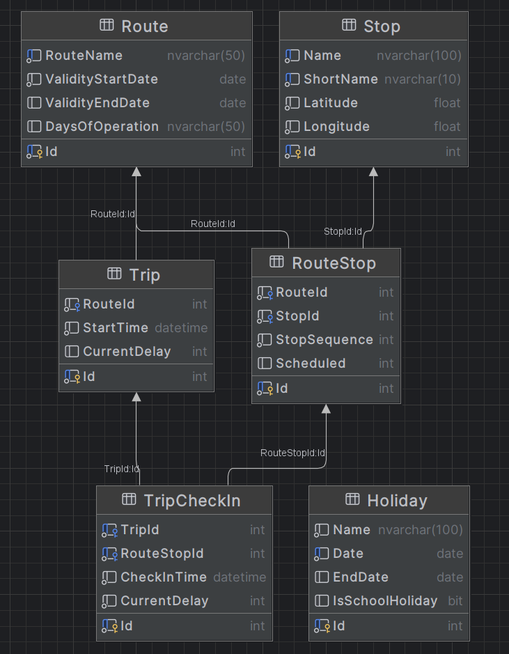

# NextStop

## Projektmitglieder

- Andreas Neubauer
- Jessica Erli

## Verwendete Datenbank
mssql

# Dokumentation SWK5

## 1 Für welches Datenmodell haben Sie sich entschieden? ER-Diagramm, etwaige Besonderheiten erklären.

### Routen
Siehe INSERTS.sql, Beispiele auf Region Amstetten bezogen, sowie auch die Feiertage und Ferien basieren auf Niederösterreich.
überschneidungen bei:
1. Haltestelle "Amstetten Bahnhof" -> Alle 3 Routen beginnen hier
2. Haltestelle "Amstetten Hauptplatz" -> Alle 3 Routen kommen hier vorbei (spiegelt eine zentrale Lage wieder)
3. Haltestelle "Amstetten Wasserturm" -> Route 1 und 2 nutzen diese Haltestelle
4. Haltestelle "Preinsbach" -> Route 1 und 3 nutzen diese Haltestelle
5. Haltestelle "Amstetten Krankenhaus" -> Route 1 und 3 nutzen diese Haltestelle

| RouteName                                     | Name                          | StopSequence | Scheduled |
|-----------------------------------------------|-------------------------------|--------------|-----------|
| Route 1: Bahnhof - Greinsfurth - Euratsfeld   | Amstetten Bahnhof             | 1            | 0         |
| Route 1: Bahnhof - Greinsfurth - Euratsfeld   | Amstetten Hauptplatz          | 2            | 3         |
| Route 1: Bahnhof - Greinsfurth - Euratsfeld   | Amstetten Krankenhaus         | 3            | 5         |
| Route 1: Bahnhof - Greinsfurth - Euratsfeld   | Amstetten Wasserturm          | 4            | 2         |
| Route 1: Bahnhof - Greinsfurth - Euratsfeld   | Greinsfurth                   | 5            | 10        |
| Route 1: Bahnhof - Greinsfurth - Euratsfeld   | Preinsbach                    | 6            | 8         |
| Route 1: Bahnhof - Greinsfurth - Euratsfeld   | Euratsfeld                    | 7            | 12        |
| Route 1: Bahnhof - Greinsfurth - Euratsfeld   | Amstetten Schloss Edla        | 8            | 15        |
| Route 1: Bahnhof - Greinsfurth - Euratsfeld   | Amstetten Rathaus             | 9            | 3         |
| Route 1: Bahnhof - Greinsfurth - Euratsfeld   | Amstetten Bahnhof             | 10           | 5         |
| Route 2: Bahnhof - Hauptplatz - Neuhofen      | Amstetten Bahnhof             | 1            | 0         |
| Route 2: Bahnhof - Hauptplatz - Neuhofen      | Amstetten Hauptplatz          | 2            | 3         |
| Route 2: Bahnhof - Hauptplatz - Neuhofen      | Amstetten Rathaus             | 3            | 2         |
| Route 2: Bahnhof - Hauptplatz - Neuhofen      | Amstetten Wasserturm          | 4            | 5         |
| Route 2: Bahnhof - Hauptplatz - Neuhofen      | Amstetten Landesberufsschule  | 5            | 8         |
| Route 2: Bahnhof - Hauptplatz - Neuhofen      | Mauer-Öhling                  | 6            | 15        |
| Route 2: Bahnhof - Hauptplatz - Neuhofen      | Neuhofen an der Ybbs          | 7            | 10        |
| Route 2: Bahnhof - Hauptplatz - Neuhofen      | Amstetten Krankenhaus         | 8            | 7         |
| Route 2: Bahnhof - Hauptplatz - Neuhofen      | Preinsbach                    | 9            | 6         |
| Route 2: Bahnhof - Hauptplatz - Neuhofen      | Amstetten Bahnhof             | 10           | 5         |
| Route 3: Bahnhof - Kollmitzberg - Zeillern    | Amstetten Bahnhof             | 1            | 0         |
| Route 3: Bahnhof - Kollmitzberg - Zeillern    | Amstetten Hauptplatz          | 2            | 3         |
| Route 3: Bahnhof - Kollmitzberg - Zeillern    | Amstetten Rathaus             | 3            | 2         |
| Route 3: Bahnhof - Kollmitzberg - Zeillern    | Amstetten Schloss Edla        | 4            | 4         |
| Route 3: Bahnhof - Kollmitzberg - Zeillern    | Ulmerfeld-Hausmening          | 5            | 15        |
| Route 3: Bahnhof - Kollmitzberg - Zeillern    | Preinsbach                    | 6            | 7         |
| Route 3: Bahnhof - Kollmitzberg - Zeillern    | Kollmitzberg                  | 7            | 12        |
| Route 3: Bahnhof - Kollmitzberg - Zeillern    | Zeillern                      | 8            | 10        |
| Route 3: Bahnhof - Kollmitzberg - Zeillern    | Amstetten Krankenhaus         | 9            | 15        |
| Route 3: Bahnhof - Kollmitzberg - Zeillern    | Amstetten Bahnhof             | 10           | 5         |

### Haltestellen
Die Haltestellen werden in der Tabelle Stop abgelegt.

### Beziehung zwischen Route und Stop
- 0..* zu 0..* Beziehung
- Attribut StopSequence: Hier steht drinnen, welche Reihenfolge die Haltestelle in der Sequenz hat
- Attribut Scheduled: Hier wird im Endeffekt vom Sequenz-Start weg (ist immer auf die Row davor bezogen) angegeben, nach wievielen Minuten das Verkehrsmittel an der Haltestelle sein sollte.

### Tabelle Trip und TripCheckIn
Hierbei handelt es sich um die konkrete Fahrt, wo auch die aktuelle Verspätung in Minuten abgebildet ist. Die Positionen und die Verspätungen werden in TripCheckIn abgebildet.

## 2 Dokumentieren Sie auf Request-Ebene den gesamten Workflow anhand eines möglichst durchgängigen Beispiels (vom Einpflegen der Haltestellen und Feiertage bis zur Planung und Durchführung einer Fahrt). Sie können ein Tool Ihrer Wahl einsetzen, z. B. Postman Workflows, VS Code, etc. HTTP-Requests inkl. HTTP-Verb, URL, Parametern, Body und Headern

## 3 Wie stellen Sie sicher, dass das Einchecken der Busse nur mit einem gültigen API-Key möglich ist?
Leider garnicht, weil bei uns die Anbindung mit Keycloak nicht funktioniert hat. We tried :(

## 4 Ein Angreifer hat Zugriff auf ein Datenbank-Backup Ihres Produktivsystems bekommen. Welchen Schaden kann er anrichten?
Also aus meiner Sicht, viel Spaß damit, viel Erfolg werden sie nicht damit haben, weil keine Personenbezogenen Daten darin abgelegt sind. Es sind dort nur Fahrpläne, Feiertage, Schulferien, die Haltestellen, die Verbindung zwischen Haltestellen und die Daten für die Check-Ins der Öffis einsehbar. Jeder, der ein bisschen recherchieren kann, findet diese Informationen auch frei im Internet.

=> Kein Schaden

## 5 Bei welchen Teilen Ihres Systems ist eine korrekte Funktionsweise aus Ihrer Sicht am kritischsten? Welche Maßnahmen haben Sie getroffen, um sie zu gewährleisten? 
Die CheckIns

## 6 Wie haben Sie die Berechnung passender Routen bei Fahrplanabfragen modular umgesetzt? Welche Teile Ihres Codes mu ssen Sie ändern, um eine andere Variante einzusetzen? 
Die Berechnung wurde modular umgesetzt indem wir Logik und Datenzugriff klar getrennt haben: Datenzugriffsschicht, Berechnungslogik und die Schnittstellen zur Darstellung sind getrennt. Dies erleichtert den Austausch von der Berechnungslogik, falls dies in Zukunft gewünscht ist und macht die Anwendung flexibler und leichter erweiterbar.

Es gibt das Interface ITripService mit der Methode GetTimetableAsync. Man müsste im Endeffekt nur einen neuen Service implementieren, der das Interface ITripService implementiert. Dann müsste man beim Program.cs nur eine Zeile (die mit der Service-Registrierung) ändern.

## 7 Welche Prüfungen führen Sie bei einem Check-in (der Standortdaten eines Busses) durch, um die Korrektheit der Daten zu gewährleisten? 
Es werden folgende Daten beim Check-In übergeben: 
- TripId
- RouteStopId
- CheckInTime

Validierung, ob die CheckInTime ein gültiger Timestamp ist.
Bei der TripId wird zuerst der Trip selektiert und wenn dieser nicht vorhanden ist, wird NotFound zurückgegeben. Bei RouteStop ebenso.

## 8 Wie stellen Sie sicher, dass Ihre API auch in außergewöhnlichen Konstellationen (Jahreswechsel, Zeitumstellung, Feiertag in den Schulferien, etc.) stets korrekte Fahrplandaten 
liefert?
Man könnte hierfür den UTC-Timestamp verwenden.

## 9 Bei der Übertragung eines API-Keys auf einen Bus ist etwas schiefgelaufen, der Bus liefert mangels gültiger Authentifizierung keine Check-in-Daten mehr. Überlegen Sie, wie Sie a) dieses Problem im Betrieb möglichst rasch erkennen können und b) Auskunft geben können, seit wann das Problem besteht. 
Man könne dieses Problem zum Beispiel durch die Verwendung von Tools wie Dynatrace, DataDog, OpenTelemetry, aber auch durch ausgebautes logging erreichen. Die Rasche Erkennung könnte zum Beispiel durch die Einrichtung von einem Alerting-System passieren (ist in Dynatrace und Co. schon implementiert, aber wenn man nur Logging verwendet kann man sich auch einen Job einrichten, der einen eine E-Mail sendet).

Seit wann das Problem besteht, kann man dann mit Filtern auf den Logs, bzw. bei Tools wie Dynatrace, DataDog durch filter in den Distributed Traces einsehen.

## 10 Denken Sie an die Skalierbarkeit Ihres Projekts: Die Wiener Linien mo chten Ihr Produkt mit über 1.000 Fahrzeugen nutzen. Was macht Ihnen am meisten Kopfzerbrechen? 
Vermutlich die Datenbank, weil viel Logik auf die Datenbank ausgelagert wurde. Es kommt natürlich drauf an, wie stark der Server ist, worauf die Datenbank läuft und wieviele Daten darin abgelegt sind und wie viele Nutzer auch darauf zugreifen werden, aber ich denke, dass es bei 1000 Bussen noch kein Problem darstellen wird (zumindest, wenn der Server die gleiche Konfiguration hat, wie der Stand-PC, auf dem entwickelt wurde).

Wenn man den Horizont noch erweitert könnte die Integration fremder Systeme noch ein Problem darstellen. (z.B. Wiener Linien und andere Konkurrenz, wodurch die Fahrplandaten nicht herausgegeben werden).

## 11. Wenn Sie das Projekt neu anfangen wu rden – was wu rden Sie anders machen? 
1. Keinen MSSQL-Server verwenden
2. Eine Entity-Relationship-Modell-Bibliothek verwenden
3. Spring anstatt ASP.NET Core